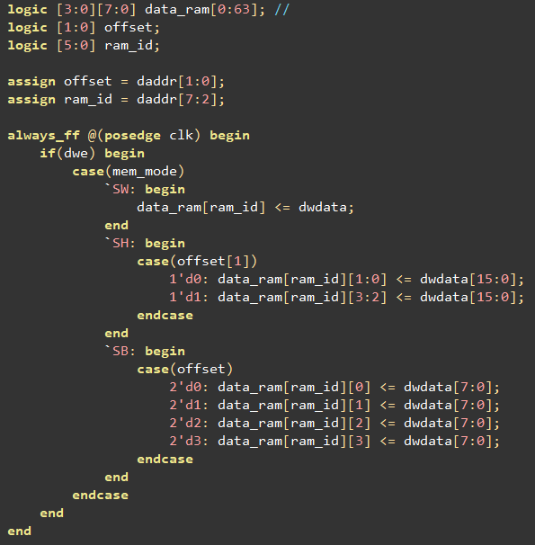
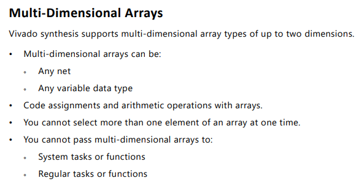
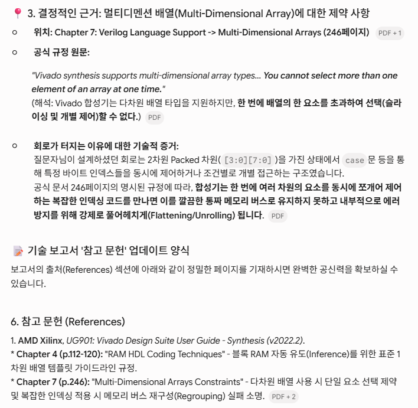
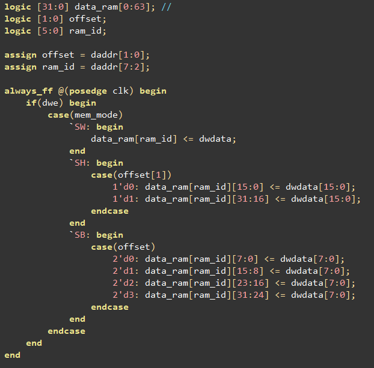
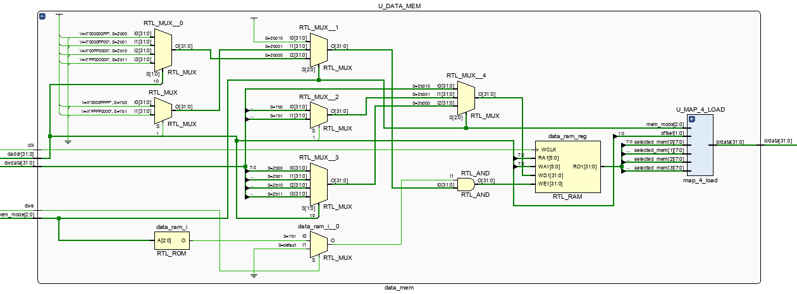
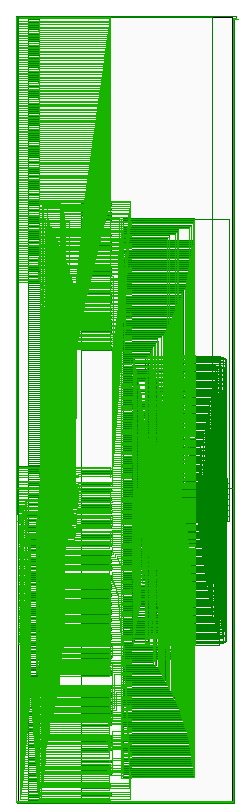

# Troubleshooting: data_mem 합성 오류 (Multi-Dimensional Packed Array)

## 증상

`data_mem.sv`에서 바이트 단위 read-modify-write를 표현하려고 2차원 packed 배열을 사용했다.

```systemverilog
logic [3:0][7:0] data_ram[0:63];   // 64 word, word당 4 byte로 slicing

always_ff @(posedge clk) begin
    if(dwe) begin
        case(mem_mode)
            `SW: data_ram[ram_id] <= dwdata;
            `SH: case(offset[1])
                    1'd0: data_ram[ram_id][1:0] <= dwdata[15:0];
                    1'd1: data_ram[ram_id][3:2] <= dwdata[15:0];
                 endcase
            `SB: case(offset)
                    2'd0: data_ram[ram_id][0] <= dwdata[7:0];
                    2'd1: data_ram[ram_id][1] <= dwdata[7:0];
                    2'd2: data_ram[ram_id][2] <= dwdata[7:0];
                    2'd3: data_ram[ram_id][3] <= dwdata[7:0];
                 endcase
        endcase
    end
end
```



시뮬레이션에서는 의도대로 동작했지만, Vivado 합성 단계에서 기대와 다른 결과가 나왔다.

## 원인 분석

AMD/Xilinx **UG901 (Vivado Design Suite User Guide: Synthesis)** Chapter 7, "Multi-Dimensional Arrays" (p.246)에 다음 제약이 명시되어 있다.

> "Vivado synthesis supports multi-dimensional array types... **You cannot select more than one element of an array at one time.**"

`data_ram[ram_id][1:0]`, `data_ram[ram_id][3:2]`처럼 하나의 `case`문 안에서 2차원 packed 배열의 서로 다른 하위 요소를 조건별로 동시에 선택/제어하는 구조는 이 제약을 위반한다. 합성기는 이런 인덱싱 패턴을 하나의 깔끔한 메모리(BRAM)로 유지하지 못하고 강제로 flatten/unroll 처리하면서 의도한 하드웨어와 달라졌다.




## 해결

`data_ram`을 2차원 packed 배열 대신 **1차원 32비트 배열**로 바꾸고, offset에 따라 필요한 비트 구간만 슬라이싱해서 쓰도록 수정했다.

```systemverilog
logic [31:0] data_ram[0:63];

always_ff @(posedge clk) begin
    if(dwe) begin
        case(mem_mode)
            `SW: data_ram[ram_id] <= dwdata;
            `SH: case(offset[1])
                    1'd0: data_ram[ram_id][15:0]  <= dwdata[15:0];
                    1'd1: data_ram[ram_id][31:16] <= dwdata[15:0];
                 endcase
            `SB: case(offset)
                    2'd0: data_ram[ram_id][7:0]   <= dwdata[7:0];
                    2'd1: data_ram[ram_id][15:8]  <= dwdata[7:0];
                    2'd2: data_ram[ram_id][23:16] <= dwdata[7:0];
                    2'd3: data_ram[ram_id][31:24] <= dwdata[7:0];
                 endcase
        endcase
    end
end
```



1차원 배열 + 비트 슬라이싱 방식은 UG901 Chapter 4 "RAM HDL Coding Techniques" (p.112-120)가 권장하는 표준 1차원 배열 템플릿과 일치해 BRAM 추론이 정상적으로 이뤄졌다.

수정 후 `U_DATA_MEM` 블록의 RTL 스케마틱:



## 참고 문헌

AMD Xilinx, *UG901: Vivado Design Suite User Guide - Synthesis (v2022.2)*
- Chapter 4 (p.112-120): "RAM HDL Coding Techniques" — 블록 RAM 자동 추론(Inference)을 위한 표준 1차원 배열 템플릿 가이드라인
- Chapter 7 (p.246): "Multi-Dimensional Arrays Constraints" — 다차원 배열 사용 시 단일 요소 선택 제약 및 복잡한 인덱싱 적용 시 메모리 버스 재구성(Regrouping) 실패 소명

전체 RTL 합성 결과 개요:


